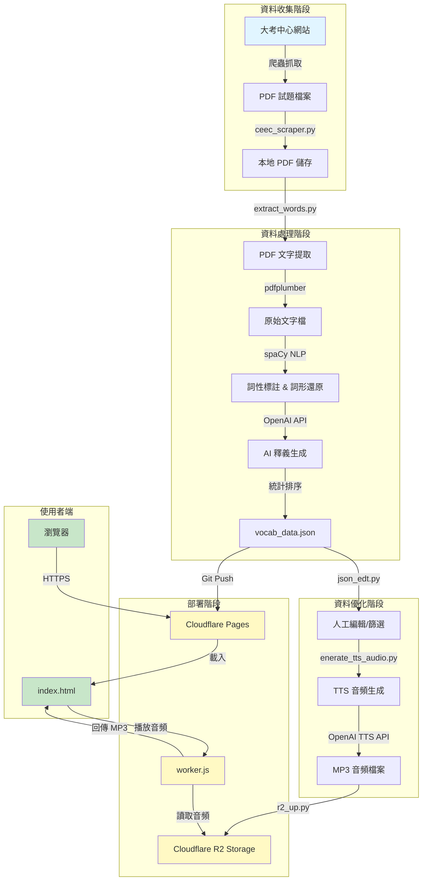
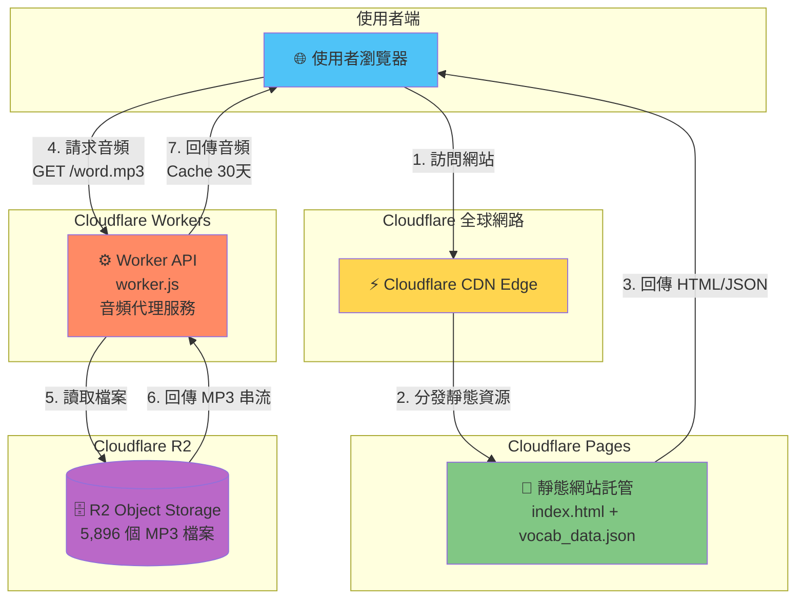
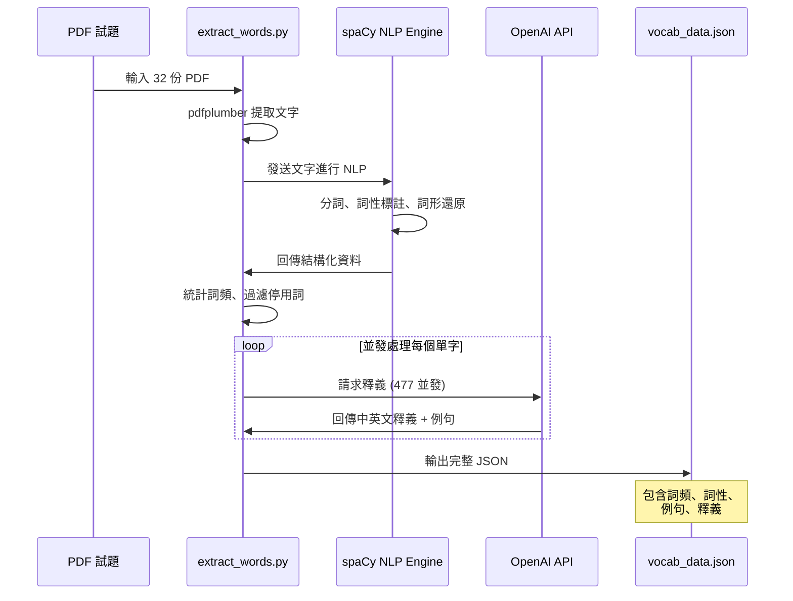
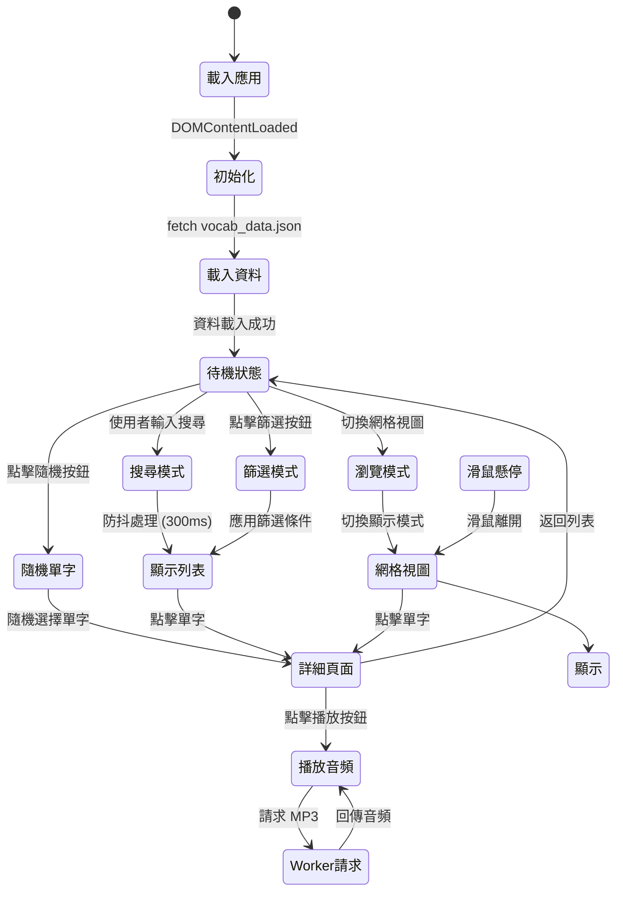

# 學測高頻單字探索系統 - 完整技術架構文檔

## 📋 目錄
- [系統概述](#系統概述)
- [系統架構圖](#系統架構圖)
- [技術堆疊](#技術堆疊)
- [資料處理流程](#資料處理流程)
- [部署架構](#部署架構)
- [詳細模組說明](#詳細模組說明)
- [API 與整合](#api-與整合)
- [部署指南](#部署指南)
- [成本估算](#成本估算)

---

## 系統概述

**學測高頻單字探索系統**是一個全自動化的英文單字學習平台，從歷屆學測試題中提取、分析並呈現高頻單字，提供完整的單字釋義、例句、詞性分布以及真人發音功能。

### 核心特色
- ✅ **自動化資料收集**: 從大考中心官網自動爬取歷屆試題
- ✅ **AI 驅動的內容生成**: 使用 OpenAI GPT 模型生成釋義與例句
- ✅ **高品質語音**: 使用 OpenAI TTS API 生成自然語音
- ✅ **無伺服器架構**: 完全部署於 Cloudflare 生態系統
- ✅ **高效能**: 利用 R2 儲存與全球 CDN 分發
- ✅ **現代化 UI**: 響應式設計，支援桌面與行動裝置

---

## 系統架構圖

### 1. 整體系統流程圖



### 2. Cloudflare 部署架構



### 3. 資料處理管線



### 4. 前端架構流程



---

## 技術堆疊

### 後端資料處理 (Python)
| 技術 | 版本 | 用途 |
|------|------|------|
| Python | 3.10+ | 主要開發語言 |
| pdfplumber | Latest | PDF 文字提取 |
| spaCy | Latest | 自然語言處理 |
| en_core_web_sm | Latest | 英文 NLP 模型 |
| OpenAI Python SDK | Latest | API 整合 |
| boto3 | Latest | AWS S3 相容 API (R2) |
| requests | Latest | HTTP 請求 |
| BeautifulSoup4 | Latest | HTML 解析 |
| tqdm | Latest | 進度條顯示 |

### 前端 (JavaScript)
| 技術 | 版本 | 用途 |
|------|------|------|
| Vanilla JavaScript | ES6+ | 前端邏輯 |
| Tailwind CSS | 3.x (CDN) | UI 樣式框架 |
| Google Fonts | - | 字型 (Inter, Noto Sans TC) |
| HTML5 Audio API | - | 音頻播放 |

### 雲端服務 (Cloudflare)
| 服務 | 用途 | 計價方式 |
|------|------|----------|
| Cloudflare Pages | 靜態網站託管 | 免費 (無限請求) |
| Cloudflare Workers | 音頻 API 端點 | 免費額度: 100k req/day |
| Cloudflare R2 | 物件儲存 | 免費額度: 10GB 儲存 |

### AI 服務 (OpenAI)
| API | 模型 | 用途 |
|-----|------|------|
| Chat Completions | gpt-4o-mini | 生成釋義與例句 |
| Text-to-Speech | gpt-4o-mini-tts | 生成單字發音 |

---

## 資料處理流程

### 階段 1: 資料收集 (`ceec_scraper.py`)

**目標**: 從大考中心網站自動下載歷屆學測英文試題 PDF

```python
# 核心功能
1. 發送 HTTP 請求至大考中心試題資料庫
2. 解析 HTML，提取試題連結
3. 過濾出「英文科試題卷」(排除答題卷、解答)
4. 批次下載 PDF 並重新命名
5. 自動去重，避免重複下載
```

**輸出**: 
- 32 份 PDF 檔案 (1994-2025 年學測試題)
- 命名格式: `{西元年}_{民國年}_{原始檔名}.pdf`

**技術亮點**:
- ✅ 使用正規表達式精準匹配「試題卷」
- ✅ 自動分頁抓取，直到沒有新檔案為止
- ✅ 重試機制處理網路錯誤
- ✅ 進度條顯示下載狀態

---

### 階段 2: NLP 分析與 AI 釋義 (`extract_words.py`)

這是整個系統最核心的模組，包含三個子階段:

#### 2.1 PDF 文字提取

```python
# 使用 pdfplumber 提取文字
def extract_text_from_pdf(pdf_file: Path) -> str:
    with pdfplumber.open(pdf_file) as pdf:
        text = "\n".join(
            p.extract_text(x_tolerance=2, y_tolerance=2) or "" 
            for p in pdf.pages
        )
    return text
```

**處理邏輯**:
1. 逐頁提取文字內容
2. 保留原始排版資訊
3. 儲存為 `.txt` 檔案備份

**輸出**: `data/raw_txt/` 資料夾中的 32 個文字檔

---

#### 2.2 spaCy NLP 處理

```python
# 載入 spaCy 模型
nlp = spacy.load("en_core_web_sm", disable=["ner"])

# 處理文字
doc = nlp(raw_text)
for sent in doc.sents:
    for token in sent:
        lemma = token.lemma_.lower()  # 詞形還原
        pos = token.pos_              # 詞性標註
```

**處理內容**:
1. **分詞 (Tokenization)**: 將文字切分為單字
2. **詞性標註 (POS Tagging)**: 判斷名詞、動詞、形容詞等
3. **詞形還原 (Lemmatization)**: 將變化形還原為原形
   - `running` → `run`
   - `better` → `good`
4. **句子分割**: 提取包含該單字的完整句子

**過濾規則**:
```python
# 排除的詞性
STOP_POS = {"ADP", "AUX", "CONJ", "DET", "NUM", "PART", "PRON", ...}

# 自訂停用詞
CUSTOM_STOP_WORDS = {'be', 'have', 'do', 'say', 'get', ...}

# 句子過濾
- 少於 5 個單字的句子
- 頁碼、章節標題
- 選項標記 (A)(B)(C)(D)
- 大寫字母超過 70% 的句子 (可能是標題)
```

**資料結構**:
```python
vocab_data = {
    "lemma": {
        "count": 125,              # 出現次數
        "pos_dist": {              # 詞性分布
            "NOUN": 80,
            "VERB": 45
        },
        "sentences": [             # 例句 (最多 5 個)
            "[2024_113] The environment is crucial...",
            "[2023_112] Environmental protection..."
        ]
    }
}
```

---

#### 2.3 OpenAI API 釋義生成

**並發架構設計**:

```python
# 使用 asyncio + Semaphore 控制並發
CONCURRENT_REQUESTS = 477  # 同時 477 個請求
semaphore = asyncio.Semaphore(CONCURRENT_REQUESTS)

async def fetch_single_definition(lemma, system_prompt, semaphore):
    async with semaphore:
        response = await client.chat.completions.create(
            model="gpt-4o-mini",
            messages=[
                {"role": "system", "content": system_prompt},
                {"role": "user", "content": lemma}
            ],
            response_format={"type": "json_object"},
            temperature=0.2
        )
```

**System Prompt**:
```
You are an expert lexicographer. For the English word provided by the user,
give a concise definition in both Traditional Chinese and English, and one 
simple example sentence in English. Respond ONLY with a single, valid JSON 
object with three keys: 'zh_def', 'en_def', and 'example'.
```

**回應格式**:
```json
{
  "zh_def": "環境；周圍的事物或情況",
  "en_def": "The surroundings or conditions in which a person, animal, or plant lives or operates",
  "example": "We must protect the environment for future generations."
}
```

**效能優化**:
- ✅ **並發請求**: 477 個請求同時進行
- ✅ **進度追蹤**: 使用 tqdm 顯示即時進度
- ✅ **錯誤處理**: Rate Limit 自動重試 (等待 10 秒)
- ✅ **超時設定**: 20 秒超時避免卡死

**輸出**: `data/output/vocab_data.json` (完整的單字資料庫)

---

### 階段 3: 資料編輯 (`json_edt.py`)

提供互動式命令列工具，用於手動編輯單字資料:

**功能**:
1. **查看單字詳細資訊**: 輸入單字名稱查看完整 JSON
2. **刪除單一單字**: 確認後刪除
3. **批次刪除**: 輸入 `word1,word2,word3` 批次刪除
4. **匯出單字列表**: 輸出純文字檔案 (每行一個單字)

**使用情境**:
- 移除無意義的單字 (如人名、地名)
- 刪除錯誤解析的詞彙
- 調整單字列表

---

### 階段 4: TTS 音頻生成 (`enerate_tts_audio.py`)

**目標**: 為每個單字生成高品質的 MP3 發音檔

**OpenAI TTS API 整合**:

```python
# 使用官方推薦的 streaming 結構
async with client.audio.speech.with_streaming_response.create(
    model="gpt-4o-mini-tts",
    voice="onyx",              # 男聲，清晰穩重
    input=word,
    response_format="mp3"
) as response:
    await response.stream_to_file(output_file)
```

**配置參數**:
- **模型**: `gpt-4o-mini-tts` (性價比最高)
- **語音**: `onyx` (男聲，適合單字發音)
- **格式**: MP3 (高壓縮比，適合網路傳輸)
- **並發數**: 15 (避免觸發 Rate Limit)
- **重試次數**: 3 次

**效能特性**:
- ✅ **斷點續傳**: 自動跳過已存在的檔案
- ✅ **並發處理**: 15 個請求同時進行
- ✅ **指數退避**: Rate Limit 時自動延遲重試
- ✅ **錯誤報告**: 記錄失敗的單字

**輸出**: 
- `data/output/tts_audio/` 資料夾
- 5,896 個 MP3 檔案
- 檔名格式: `{lemma}.mp3` (例如: `environment.mp3`)

---

### 階段 5: 音頻上傳至 R2 (`r2_up.py`)

**Cloudflare R2 簡介**:
- S3 相容的物件儲存服務
- **零出口費用** (No Egress Fees)
- 全球 CDN 分發
- 高可用性、高耐久性

**上傳策略**:

```python
# 使用 boto3 S3 相容 API
s3 = boto3.client(
    's3',
    endpoint_url=f"https://{account_id}.r2.cloudflarestorage.com",
    aws_access_key_id=access_key_id,
    aws_secret_access_key=secret_access_key,
    config=Config(
        retries={
            'max_attempts': 10,    # 最多重試 10 次
            'mode': 'adaptive'     # 自適應重試 (指數退避)
        }
    )
)

# 多執行緒並發上傳
with ThreadPoolExecutor(max_workers=10) as executor:
    futures = {executor.submit(upload_file, s3, f, bucket): f for f in files}
```

**配置**:
- **Bucket**: `vocab-audio`
- **並發數**: 10 個執行緒
- **重試策略**: 自適應模式 (Adaptive Retry)
- **進度追蹤**: tqdm 進度條

**環境變數**:
```bash
R2_ACCOUNT_ID=your_account_id
R2_ACCESS_KEY_ID=your_access_key
R2_SECRET_ACCESS_KEY=your_secret_key
```

---

## 部署架構

### Cloudflare Pages (前端託管)

**部署內容**:
```
發行/
├── index.html                    # 主應用程式
└── data/
    └── output/
        └── vocab_data.json       # 單字資料庫 (約 100MB)
```

**部署方式**:
1. 將 `發行/` 資料夾推送至 Git 倉庫
2. 在 Cloudflare Pages 中連結倉庫
3. 設定建置命令: (無需建置)
4. 設定輸出目錄: `發行/`
5. 自動部署成功

**特性**:
- ✅ 全球 CDN 加速 (275+ 資料中心)
- ✅ 自動 HTTPS 憑證
- ✅ 無限頻寬與請求
- ✅ Git 整合，推送即部署
- ✅ 預覽環境 (每個 PR 獨立網址)

---

### Cloudflare Workers (音頻 API)

**Worker 程式碼解析** (`worker.js`):

```javascript
export default {
  async fetch(request, env, ctx) {
    const url = new URL(request.url);
    const objectKey = url.pathname.slice(1); // 移除開頭的 "/"
    
    // 1. 安全性檢查
    if (request.method !== 'GET') {
      return new Response('Method Not Allowed', { status: 405 });
    }
    if (!objectKey || !objectKey.endsWith('.mp3')) {
      return new Response('Invalid request', { status: 400 });
    }
    
    // 2. 從 R2 取得檔案
    const object = await env.AUDIO_BUCKET.get(objectKey);
    if (object === null) {
      return new Response('Object Not Found', { status: 404 });
    }
    
    // 3. 設定快取標頭
    const headers = new Headers();
    object.writeHttpMetadata(headers);
    headers.set('cache-control', 'public, max-age=2592000'); // 30 天
    
    // 4. 回傳音頻串流
    return new Response(object.body, { headers });
  }
}
```

**關鍵設計**:

1. **R2 Binding**: 
   - 在 Worker 設定中綁定 R2 Bucket
   - 變數名稱: `AUDIO_BUCKET`
   - Bucket: `vocab-audio`

2. **請求流程**:
   ```
   用戶請求: https://vocab-audio.vic0407lu.workers.dev/environment.mp3
         ↓
   Worker 解析路徑: environment.mp3
         ↓
   從 R2 讀取: env.AUDIO_BUCKET.get("environment.mp3")
         ↓
   回傳串流 + Cache-Control 標頭
   ```

3. **快取策略**:
   - **Cache-Control**: `public, max-age=2592000` (30 天)
   - **ETag**: 自動由 R2 提供，支援條件請求
   - **邊緣快取**: Cloudflare 自動在邊緣節點快取

4. **效能優化**:
   - ✅ **串流傳輸**: 不將整個檔案載入記憶體
   - ✅ **零延遲**: 在 R2 同機房讀取
   - ✅ **全球分發**: 快取在 275+ 邊緣節點

**Worker 設定**:
```bash
# wrangler.toml
name = "vocab-audio"
main = "worker.js"
compatibility_date = "2024-01-01"

[[r2_buckets]]
binding = "AUDIO_BUCKET"
bucket_name = "vocab-audio"
```

**部署指令**:
```bash
npx wrangler deploy
```

---

### 前端應用程式 (`index.html`)

**技術架構**:

1. **單頁應用 (SPA)**: 
   - 無需框架，純 Vanilla JavaScript
   - 事件驅動架構
   - 狀態管理由閉包變數實現

2. **資料流**:
   ```
   初始化 → fetch vocab_data.json → 儲存至 allWords 陣列
                                          ↓
                                    應用篩選條件
                                          ↓
                                    filteredWords 陣列
                                          ↓
                                    渲染至 DOM
   ```

3. **核心功能模組**:

   **a. 搜尋與篩選**:
   ```javascript
   // 防抖處理 (300ms)
   searchInput.addEventListener('input', debounce(e => {
       currentFilters.searchTerm = e.target.value.toLowerCase();
       applyFilters();
   }, 300));
   
   // 複合篩選
   function applyFilters() {
       let words = [...allWords];
       
       // 搜尋詞篩選
       if (currentFilters.searchTerm) {
           words = words.filter(w => 
               w.lemma.startsWith(currentFilters.searchTerm)
           );
       }
       
       // 頻率篩選 (核心 1-200, 常見 201-800, 更多 801+)
       if (currentFilters.freq !== 'all') {
           const [min, max] = freqRanges[currentFilters.freq];
           words = words.filter(w => {
               const rank = allWords.findIndex(f => f.lemma === w.lemma) + 1;
               return rank >= min && rank <= max;
           });
       }
       
       // 詞性篩選
       if (currentFilters.pos !== 'all') {
           words = words.filter(w => 
               Object.keys(w.pos_dist).includes(currentFilters.pos)
           );
       }
       
       filteredWords = words;
       renderWordList();
   }
   ```

   **b. 兩種顯示模式**:
   
   - **列表模式** (預設):
     ```html
     <div class="list-item">
         <span>environment</span>
         <span class="badge">NOUN</span>
         <span class="count">125</span>
     </div>
     ```
   
   - **網格瀏覽模式**:
     ```html
     <div class="browse-cell">environment</div>
     ```
     - Hover 顯示 Tooltip
     - CSS Grid 自適應排列
     - 適合快速瀏覽大量單字

   **c. 音頻播放整合**:
   ```javascript
   // 共用 Audio 物件，避免重複建立
   let audioPlayer = new Audio();
   
   document.getElementById('play-audio-btn').addEventListener('click', () => {
       const lemma = document.getElementById('detail-lemma').textContent.toLowerCase();
       const workerBaseUrl = 'https://vocab-audio.vic0407lu.workers.dev';
       const audioUrl = `${workerBaseUrl}/${lemma}.mp3`;
       
       audioPlayer.src = audioUrl;
       audioPlayer.play().catch(error => {
           console.error('播放失敗', error);
       });
   });
   ```

   **d. 響應式設計**:
   ```css
   /* 桌面版: 三欄式佈局 */
   @media (min-width: 1024px) {
       .control-panel { width: 25%; }
       .word-list { width: 33%; }
       .detail-panel { width: 42%; }
   }
   
   /* 行動版: 單欄 + 滑入動畫 */
   @media (max-width: 1023px) {
       #detail-wrapper {
           transform: translateX(100%);
           transition: transform 0.3s ease-in-out;
       }
       .mobile-detail-view-active #detail-wrapper {
           transform: translateX(0);
       }
   }
   ```

4. **效能優化**:
   - ✅ **防抖 (Debounce)**: 搜尋輸入延遲 300ms 執行
   - ✅ **虛擬滾動**: (未實作，但可優化) 大量資料時只渲染可見區域
   - ✅ **事件委派**: 在父容器監聽點擊事件
   - ✅ **CSS 動畫**: 使用 GPU 加速的 transform
   - ✅ **圖片懶載入**: (無圖片，N/A)

---

## API 與整合

### OpenAI API 整合細節

#### 1. Chat Completions API

**端點**: `https://api.openai.com/v1/chat/completions`

**請求範例**:
```json
{
  "model": "gpt-4o-mini",
  "messages": [
    {
      "role": "system",
      "content": "You are an expert lexicographer..."
    },
    {
      "role": "user",
      "content": "environment"
    }
  ],
  "response_format": { "type": "json_object" },
  "temperature": 0.2,
  "timeout": 20.0
}
```

**速率限制**:
- **Tier 1**: 500 RPM (每分鐘請求數)
- **並發策略**: 使用 `asyncio.Semaphore(477)` 控制
- **成本**: $0.15 / 1M input tokens, $0.60 / 1M output tokens
- **估算**: 10,000 單字約 $2-3 USD

---

#### 2. Text-to-Speech API

**端點**: `https://api.openai.com/v1/audio/speech`

**請求參數**:
```python
{
    "model": "gpt-4o-mini-tts",
    "voice": "onyx",
    "input": "environment",
    "response_format": "mp3"
}
```

**語音選項**:
- `alloy`: 中性
- `echo`: 男聲
- `fable`: 英式口音
- `onyx`: 男聲，清晰 ✅ (本專案使用)
- `nova`: 女聲
- `shimmer`: 女聲，柔和

**成本估算**:
- **定價**: $15.00 / 1M characters
- **平均長度**: 每單字約 8 字元
- **5,896 個單字**: 約 47,168 字元 = **$0.71 USD**

---

### Cloudflare R2 API

**相容性**: 完全相容 AWS S3 API

**認證方式**:
```python
s3 = boto3.client(
    's3',
    endpoint_url='https://<account_id>.r2.cloudflarestorage.com',
    aws_access_key_id='<access_key>',
    aws_secret_access_key='<secret_key>'
)
```

**常用操作**:
```python
# 上傳檔案
s3.upload_file(local_path, bucket_name, object_key)

# 列出物件
response = s3.list_objects_v2(Bucket=bucket_name, Prefix='prefix/')

# 刪除物件
s3.delete_object(Bucket=bucket_name, Key=object_key)

# 取得物件 (在 Worker 中)
const object = await env.AUDIO_BUCKET.get(objectKey);
```

**定價**:
- **儲存**: $0.015 / GB / 月 (免費額度: 10 GB)
- **Class A 操作** (寫入): $4.50 / 百萬次
- **Class B 操作** (讀取): $0.36 / 百萬次
- **出口費用**: **$0** ⭐ (相比 S3 節省大量成本)

---

## 部署指南

### 前置準備

**1. 安裝 Python 環境**:
```bash
# 建立虛擬環境
python3 -m venv venv
source venv/bin/activate  # macOS/Linux
# 或
venv\Scripts\activate  # Windows

# 安裝依賴
pip install pdfplumber spacy openai boto3 requests beautifulsoup4 tqdm python-dotenv
python -m spacy download en_core_web_sm
```

**2. 設定環境變數**:
建立 `.env` 檔案:
```bash
OPENAI_API_KEY=sk-proj-...
R2_ACCOUNT_ID=your_account_id
R2_ACCESS_KEY_ID=your_access_key_id
R2_SECRET_ACCESS_KEY=your_secret_access_key
```

**3. 建立 Cloudflare 帳號**:
- 註冊 [Cloudflare](https://dash.cloudflare.com/sign-up)
- 建立 R2 Bucket: `vocab-audio`
- 取得 API Token

---

### 完整部署流程

#### 步驟 1: 資料收集與處理

```bash
# 1. 下載學測試題 PDF
python ceec_scraper.py
# 輸出: ceec_english_papers/*.pdf

# 2. 提取單字並生成釋義
python extract_words.py
# 輸出: 
#   - data/raw_txt/*.txt (原始文字)
#   - data/output/vocab_data.json (單字資料庫)

# 3. (可選) 編輯單字資料
python json_edt.py
# 互動式刪除不需要的單字

# 4. 生成 TTS 音頻
python enerate_tts_audio.py
# 輸出: data/output/tts_audio/*.mp3 (5,896 個檔案)
```

---

#### 步驟 2: 部署音頻至 R2

```bash
# 上傳音頻檔案
python r2_up.py
# 確保環境變數已設定
```

**檢查上傳結果**:
```bash
# 使用 rclone 或 Cloudflare Dashboard 檢查
# 應該看到 5,896 個 MP3 檔案
```

---

#### 步驟 3: 部署 Cloudflare Worker

**建立 Worker 專案**:
```bash
# 安裝 Wrangler CLI
npm install -g wrangler

# 登入 Cloudflare
wrangler login

# 建立 wrangler.toml
cat > wrangler.toml << EOF
name = "vocab-audio"
main = "worker.js"
compatibility_date = "2024-01-01"

[[r2_buckets]]
binding = "AUDIO_BUCKET"
bucket_name = "vocab-audio"
EOF

# 部署 Worker
wrangler deploy
```

**測試 Worker**:
```bash
curl https://vocab-audio.your-account.workers.dev/environment.mp3
# 應該回傳 MP3 音頻檔案
```

---

#### 步驟 4: 部署前端至 Cloudflare Pages

**方法 A: 使用 Git (推薦)**

```bash
# 1. 初始化 Git 倉庫
git init
git add 發行/
git commit -m "Initial deploy"

# 2. 推送至 GitHub/GitLab
git remote add origin https://github.com/your-username/vocab-app.git
git push -u origin main

# 3. 在 Cloudflare Dashboard:
#    - Pages → Create a project
#    - 連結 Git 倉庫
#    - Build settings:
#      - Build command: (留空)
#      - Build output directory: 發行
#    - Deploy
```

**方法 B: 使用 Wrangler CLI**

```bash
cd 發行
wrangler pages deploy . --project-name=vocab-app
```

**自訂網域設定** (可選):
```
1. 在 Cloudflare Pages 專案設定中
2. Custom domains → Add a custom domain
3. 輸入你的網域 (例如: vocab.example.com)
4. 按照指示設定 DNS 記錄
```

---

#### 步驟 5: 更新前端 Worker URL

**編輯 `index.html`**:
```javascript
// 第 352 行
const workerBaseUrl = 'https://vocab-audio.your-account.workers.dev';
```

改為您實際的 Worker URL，然後重新部署。

---

### 驗證部署

**檢查清單**:

1. ✅ **前端可正常訪問**
   - 開啟 `https://your-app.pages.dev`
   - 檢查是否顯示單字列表

2. ✅ **資料載入成功**
   - 開啟瀏覽器開發者工具 (F12)
   - Network 頁籤應看到 `vocab_data.json` 成功載入 (200 OK)

3. ✅ **搜尋與篩選功能**
   - 測試搜尋框輸入
   - 測試頻率篩選按鈕
   - 測試詞性篩選按鈕

4. ✅ **音頻播放功能**
   - 點擊任意單字
   - 點擊播放按鈕
   - 應聽到清晰的單字發音

5. ✅ **響應式設計**
   - 測試桌面瀏覽器
   - 測試手機瀏覽器
   - 檢查佈局是否正確

---

## 成本估算

### 一次性成本 (資料處理階段)

| 項目 | 數量 | 單價 | 總計 |
|------|------|------|------|
| OpenAI Chat Completions<br/>(生成釋義) | ~10,000 單字<br/>約 20M tokens | Input: $0.15/1M<br/>Output: $0.60/1M | **~$3** |
| OpenAI TTS<br/>(生成發音) | 5,896 單字<br/>約 47,168 字元 | $15/1M characters | **$0.71** |
| **一次性總計** | - | - | **~$4** |

### 月度營運成本 (假設 1,000 MAU)

| 服務 | 用量估算 | 計價 | 月費用 |
|------|----------|------|--------|
| **Cloudflare Pages** | 無限請求 | 免費 | **$0** |
| **Cloudflare Workers** | ~50,000 音頻請求<br/>(每用戶 50 次播放) | 免費額度: 100k/day | **$0** |
| **Cloudflare R2 儲存** | 約 500 MB | 免費額度: 10 GB | **$0** |
| **R2 Class B 操作**<br/>(讀取) | 50,000 次 | $0.36 / 百萬次 | **$0.02** |
| **R2 出口流量** | ~25 GB<br/>(500 MB × 50 次) | **$0 (免費)** ⭐ | **$0** |
| **月度總計** | - | - | **~$0.02** |

### 擴展成本 (假設 10,000 MAU)

| 用戶數 | 請求數/月 | Workers 費用 | R2 讀取費用 | 總計 |
|--------|-----------|--------------|-------------|------|
| 1,000 | 50,000 | $0 | $0.02 | **$0.02** |
| 10,000 | 500,000 | $0 | $0.18 | **$0.18** |
| 100,000 | 5,000,000 | $0.50* | $1.80 | **$2.30** |

*Workers 免費額度為 100,000 請求/天 = 3,000,000/月，超出後 $0.50/百萬次

---

## 系統特色總結

### 技術優勢

1. **全自動化流程**
   - 從資料收集到部署全部自動化
   - 零人工標註，全靠 AI 生成
   - 可輕鬆擴展至其他考試或領域

2. **高效能架構**
   - 無伺服器架構，無需維護伺服器
   - 全球 CDN 分發，低延遲存取
   - 智慧快取策略，減少 API 呼叫

3. **極低成本**
   - 月度營運成本趨近於零
   - 無流量費用 (R2 零出口費)
   - 免費額度足夠中小型專案

4. **優秀的使用者體驗**
   - 現代化 UI 設計
   - 響應式佈局
   - 流暢的動畫效果
   - 高品質 AI 語音

5. **可擴展性**
   - 資料處理管線可重複使用
   - 輕鬆新增更多單字或試題
   - 模組化設計，易於維護

---

## 未來優化方向

### 功能增強
- [ ] 加入單字收藏功能 (localStorage)
- [ ] 學習進度追蹤
- [ ] 單字卡片模式 (Flashcard)
- [ ] 測驗功能
- [ ] 使用者帳號系統

### 效能優化
- [ ] 虛擬滾動 (Virtual Scrolling)
- [ ] Service Worker 離線支援
- [ ] 圖片 WebP 格式 (如有圖片)
- [ ] 使用 IndexedDB 快取資料

### 資料增強
- [ ] 新增更多考試資料 (指考、統測)
- [ ] 加入詞源 (Etymology)
- [ ] 相關單字推薦
- [ ] 詞彙難度分級 (CEFR)

### 多語言支援
- [ ] 介面多語言 (英文、日文)
- [ ] 多語言釋義
- [ ] 多語言語音

---

## 常見問題 (FAQ)

### Q1: 為什麼選擇 Cloudflare 而不是 AWS?
**A**: Cloudflare R2 的零出口費用能節省大量成本，且 Worker 與 Pages 的整合非常順暢，部署簡單。

### Q2: 可以更換 TTS 語音嗎?
**A**: 可以，在 `enerate_tts_audio.py` 中修改 `TTS_VOICE` 參數，選項包括 `alloy`, `echo`, `fable`, `onyx`, `nova`, `shimmer`。

### Q3: 如何更新單字資料庫?
**A**: 
1. 重新執行 `extract_words.py` 處理新的 PDF
2. 執行 `python enerate_tts_audio.py` 生成新單字的音頻
3. 執行 `python r2_up.py` 上傳新音頻
4. 將新的 `vocab_data.json` 推送至 Git，觸發 Pages 部署

### Q4: 可以部署在其他平台嗎?
**A**: 可以，前端可部署在任何靜態網站託管服務 (Vercel, Netlify)，但需要改寫 Worker 為對應平台的 Serverless Function。

### Q5: 並發數為何設定為 477?
**A**: 這是根據 OpenAI Tier 1 的速率限制 (500 RPM) 微調的，保留一些緩衝避免觸發限制。請根據您的 Tier 調整。

---

## 技術支援

### 相關文件
- [Cloudflare Pages 文件](https://developers.cloudflare.com/pages/)
- [Cloudflare Workers 文件](https://developers.cloudflare.com/workers/)
- [Cloudflare R2 文件](https://developers.cloudflare.com/r2/)
- [OpenAI API 文件](https://platform.openai.com/docs/)
- [spaCy 文件](https://spacy.io/usage)

### 開源專案資訊
- **專案名稱**: 學測高頻單字探索系統
- **版本**: v7.0
- **最後更新**: 2025-10-02
- **開發者**: [您的名稱]

---

## 授權資訊

本專案僅供教育與學習用途。

**資料來源**:
- 試題資料: 大學入學考試中心 (CEEC)
- AI 模型: OpenAI GPT-4o-mini & TTS
- NLP 模型: spaCy en_core_web_sm

**第三方服務**:
- Cloudflare Pages, Workers, R2
- OpenAI API
- Tailwind CSS
- Google Fonts

---

**文檔結束** - 祝您部署順利! 🚀


